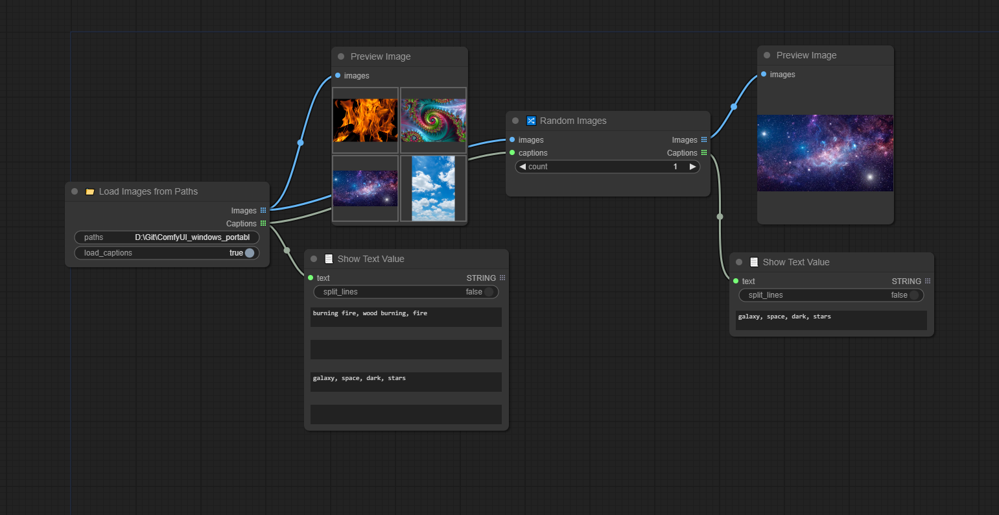

# ComfyUI-D00MYsNodes
A set of custom nodes for ComfyUI I needed for myself but I'm sharing with the public. 

- **Images_Converter** : Images conversions to any PNG, JPEG, or others, keeping their respective size and ratio.
- **Show_Text** : Show a text or list of text values.
- **Strings_From_List** : Split the text or list to get one or many text outputs.
- **Random_Images** : Pick random images from a list of images with optional captions that comes with the images.
- **Load_Images_from_Paths** : Load images from their file paths, keeping their respective size and ratio with optional loading of captions.
- **JSPaint** : Integration of JSPaint into ComfyUI.

## Conversion + Show Text + Split String + Load Images from Paths

## Load Images from Paths (with captions) + Random Images 

The filename of the caption must be the same as the matching image with the extension: `.txt` or `.caption`.
For eg. with `banana.png`, it will try to load in the same directory the following files if they exist :
- `banana.txt` | `banana.png.txt`
- `banana.caption` | `banana.png.caption`

## JSPaint

## Credits

- JSPaint : https://github.com/1j01/jspaint/
- For inspirations : 
    - pythongosssss custom scripts : https://github.com/pythongosssss/ComfyUI-Custom-Scripts
    - GeekyRemB : https://github.com/GeekyGhost/ComfyUI-GeekyRemB
