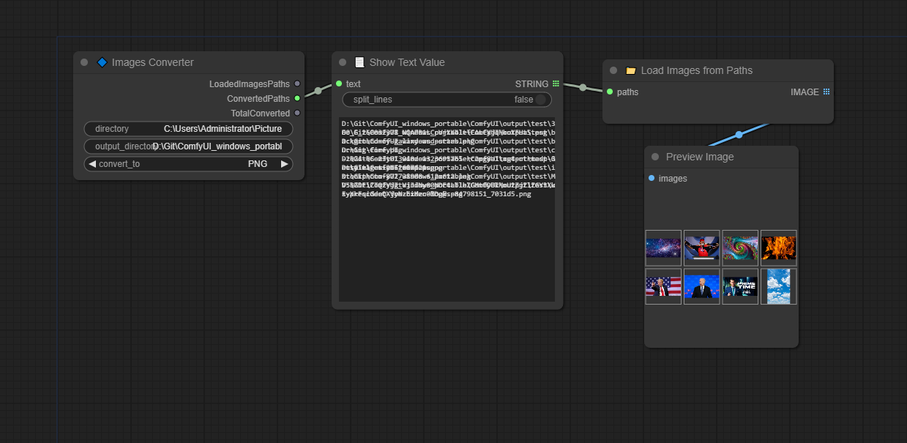
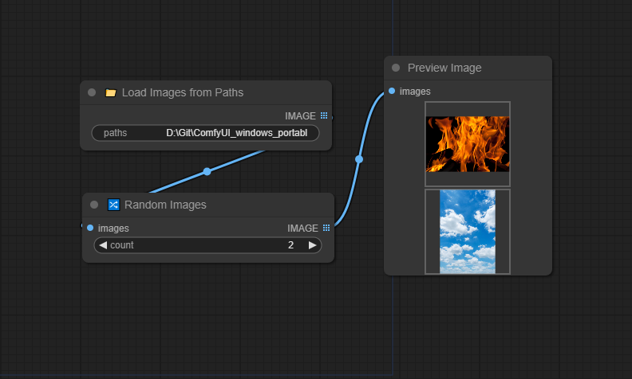
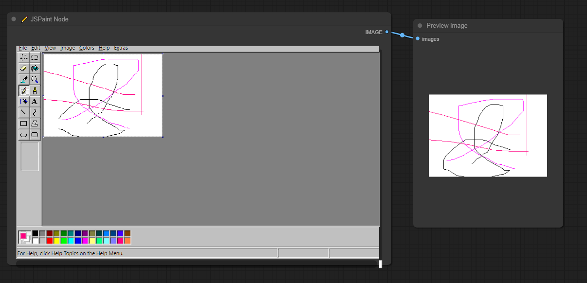

# ComfyUI-D00MYsNodes
A set of custom nodes for ComfyUI I needed for myself but I'm sharing with the public. 

- **Images_Converter** : Images conversions to any PNG, JPEG, or others, keeping their respective size and ratio.
- **Show_Text** : Show a text or list of text values.
- **Strings_From_List** : Split the text or list to get one or many text outputs.
- **Random_Images** : Pick random images from a list of images.
- **Load_Images_from_Paths** : Load images from their file paths, keeping their respective size and ratio.
- **JSPaint** : Integration of JSPaint into ComfyUI

## Conversion + Show Text + String + Load Images from Paths

## Random Images

## JSPaint

## Credits

- JSPaint : https://github.com/1j01/jspaint/
- For inspirations : 
    - pythongosssss custom scripts : https://github.com/pythongosssss/ComfyUI-Custom-Scripts
    - GeekyRemB : https://github.com/GeekyGhost/ComfyUI-GeekyRemB
