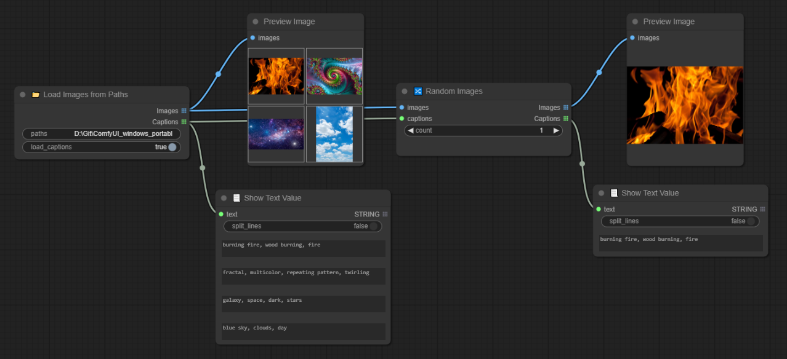

# ComfyUI-D00MYsNodes
A set of custom nodes for ComfyUI I needed for myself but I'm sharing with the public. 

- **Images_Converter** : Images conversions to any PNG, JPEG, or others, keeping their respective size and ratio.
- **Show_Text** : Show a text or list of text values.
- **Strings_From_List** : Split the text or list to get one or many text outputs.
- **Save_Text** : Save a .txt file. Can be used to save image captions with optional images paths.
- **Save_Images** : Save images and return their file paths. Now with optional metadata saving.
- **Random_Images** : Pick random images from a list of images with optional captions that comes with the images.
- **Load_Images_from_Paths** : Load images from their file paths, keeping their respective size and ratio with optional loading of captions.
- **JSPaint** : Integration of JSPaint into ComfyUI.

## Conversion + Show Text + Split String + Load Images from Paths

## Load Images from Paths (with captions) + Random Images 

The filename of the caption must be the same as the matching image with the extension: `.txt` or `.caption`.
For eg. with `banana.png`, it will try to load in the same directory the following files if they exist :
- `banana.txt` | `banana.png.txt`
- `banana.caption` | `banana.png.caption`

## Save Images + Save Text (captions)

The `filename_prefix` is ignored for the `Save Text` node because we are passing it the saved image path.
It will take the same filename name as the image.
N.B. In this example I just do preprocessing on the image but it can be used in various ways; connect it to WD-Tagger after the sampling to automatically caption your images for instance.

## Save Images (with Metadata)

In the latest version of this set of custom node, the option to save metadata checks for the seed, sampler, etc. automatically but sometimes the detection of
the positive and negative prompt are wonky (if you load them from a path), in this case it's possible to pass the string value to the **Save Images** node.

N.B. The metadata extraction of the seed, sampler, cfg, etc. will be wonky too if there's many KSampler nodes and sampling happenning in the same workflow.

## JSPaint

## Credits

- JSPaint : https://github.com/1j01/jspaint/
- For inspirations : 
    - pythongosssss custom scripts : https://github.com/pythongosssss/ComfyUI-Custom-Scripts
    - GeekyRemB : https://github.com/GeekyGhost/ComfyUI-GeekyRemB
    - alexopus : https://github.com/alexopus/ComfyUI-Image-Saver/
